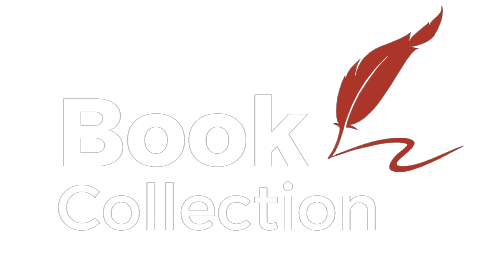
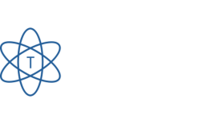
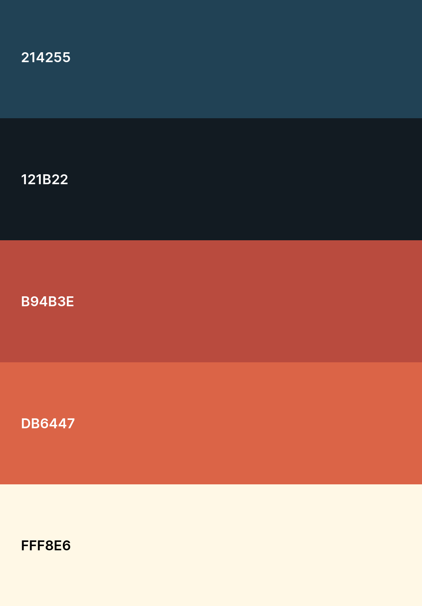
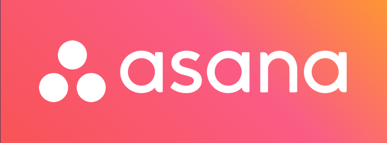

# **Bit10Team**

## **_Descripción_**

Página de busqueda y dibulgación de textos literarios los cuales el usuario puede agregar, editar o eliminarlos de su propia lista. También, encontrara un apartado de los miembros del equipo de desarrollo.

### _Logo Proyecto_



### _Logo Team_



## **_Estilos Generales_**

1. **Tipografia** 

  - **_Primaria:_** Mynerve 
```sh
font-family: 'Inter', sans-serif;
```
   - **_Secundaria:_**  Roboto Mono
```sh
font-family: 'Roboto Mono', monospace;
```
2. **Paleta de colores**
 

## _**Wireframe**_

| Nombre | Link |
| ------ | ------ |
| Wireframe Baja | [Visualizar en Jamboard](https://jamboard.google.com/d/1eJa1pU6xK3mz4NtkUF7mlWvU8QhbN-glVlcAh_0H-lk/edit?usp=sharing) |
| Wireframe Alta | [Visualizar en Canva](https://www.canva.com/design/DAFb0gxRbeM/jYq38C2u4LbUa3hXFbJ_0g/view?mode=prototype) |

## _**Directrices de grupo**_
### Roles
- **Daniel:** Encargado de la docuementación
- **Nicolas:** Encargado de el repositorio
- **Sharon:** Encargada de wireframe de alta y lider de grupo

### Horarios
Se acordo trabajar despues de 12md y antes de 4:30 se hace una reunion de seguimiento
> **Nota:** Forma de comunicacion via Google Meet

### Herramientas de Seguimiento 
 

### Tecnologias aplicadas
- HTML
- CSS
- Javascript
- Boostrap
- React -vite

### Sobre los encargados
- [Daniel Romero](https://github.com/3lD4n1el) 
- [Sharon Monroy](https://github.com/Sharontatiana)
- [Nicolas Olmos](https://github.com/nicolasnos)
