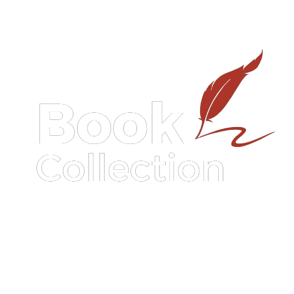
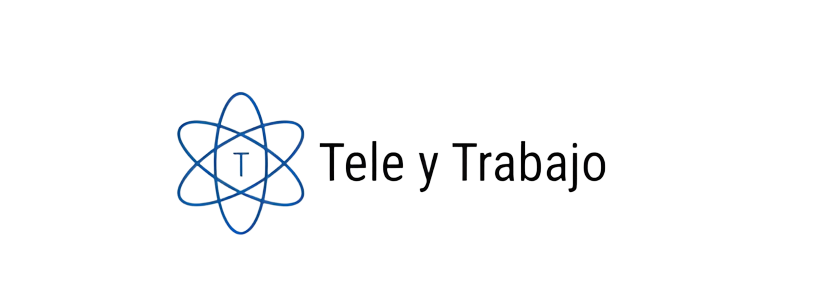

# bit10Team

## Descripcion de la página:

-Página de busqueda y dibulgación de textos literarios los cuales el usuario puede agregar, editar o eliminarlos de su propia lista
-También hay un apartado de los miembros del equipo de desarrollo

### Roles

Daniel: Encargado de la docuementación
Nicolas: Encargado de el repositorio
Sharon: Encargada de wireframe de alta y lider de grupo

#### Logo Proyecto

#### Logo Team

Daniel: Encargado de la docuementación
Nicolas: Encargado de el repositorio
Sharon: encargada de wireframe de alta y lider de grupo

#### Documentacion

**Guia de estilos del proyecto - team**

Estilos de tipografia proyecto - team:

-Primaria
'https://fonts.googleapis.com/css2?family=Mynerve&display=swap' sans-serif;

-Secundaria
https://fonts.googleapis.com/css2?family=Roboto+Mono:ital,wght@1,300&display=swap' Roboto Mono, monospace;

-Paleta de colores:
#121B22
#214255
#B94B3E
#DB6447
#AB3529
#3D1F1D
#FFF8E6

**Wireframe de baja**
https://jamboard.google.com/d/1eJa1pU6xK3mz4NtkUF7mlWvU8QhbN-glVlcAh_0H-lk/edit?usp=sharing

### Arreglos de grupo

-Horarios: Se acordo trabajar despues de 12md y antes de 4:30 se hace una reunion de seguimiento
-Forma de comunicacion: A traves de una meet: https://meet.google.com/uow-wffw-yiu
-Plataforma de seguimiento: Asana.

### Sobre los encargados

- https://github.com/3lD4n1el
- https://github.com/Sharontatiana
- https://github.com/nicolasnos

### Tecnologias aplicadas

- HTML
- CSS
- Javascript
- Boostrap
- React -vite
